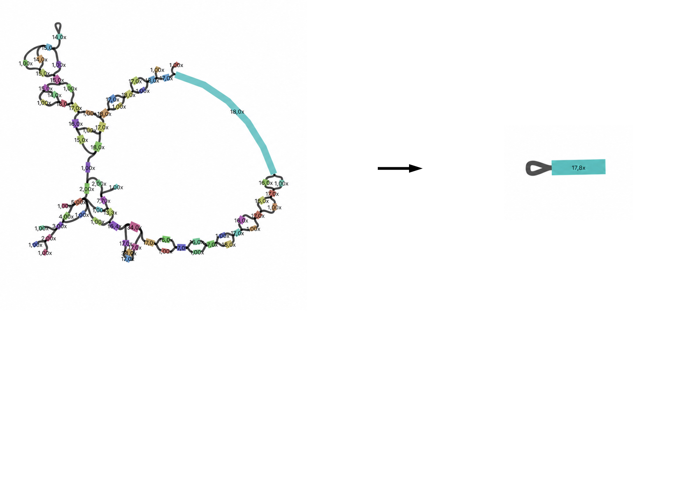
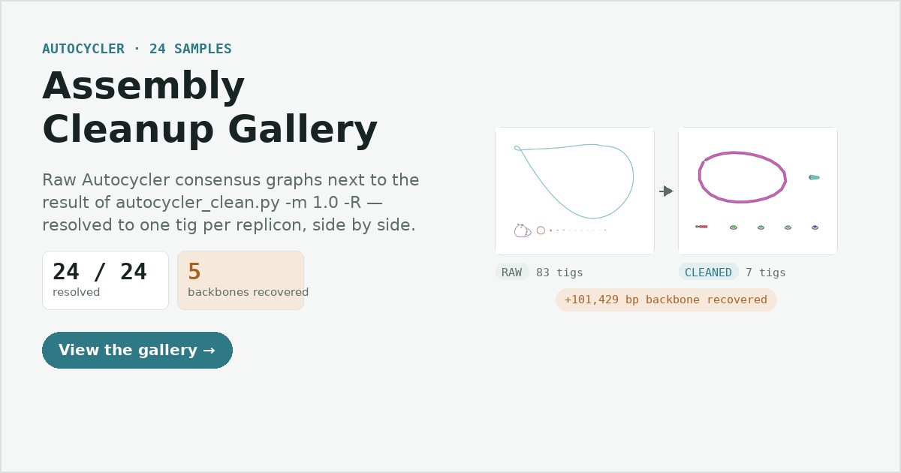

<p align="center"></p>

# linear-plasmid-hairpin-tools

Small, dependency-free Python tools for working out the **topology** of
bacterial replicons from [Autocycler](https://github.com/rrwick/Autocycler)
long-read assemblies — deciding whether each cluster/replicon is **circular** or
**linear**, resolving replicons that Autocycler left **fragmented** across
several tigs, and detecting the **hairpin / terminal-inverted-repeat ends**
that mark linear plasmids.

These were built while hunting putative linear plasmids in ONT bacterial
assemblies. They read Autocycler and raw-assembler GFA/FASTA files directly and
classify topology from the graph structure and sequence, rather than from
dot-plot pixels (which conflate strand orientation and inverted repeats with
topology).

[](https://claude.ai/code/artifact/139deab6-c1db-40a3-9321-b652cd3deec6)
<p align="center"><sub><a href="https://claude.ai/code/artifact/139deab6-c1db-40a3-9321-b652cd3deec6">Assembly Cleanup Gallery</a> — raw vs. <code>autocycler_clean.py</code>-cleaned Bandage renders for all 24 samples in the run below.</sub></p>

Four tools:

| Script | What it does |
| --- | --- |
| `autocycler_dotplot_classify.py` | Classify each Autocycler cluster / consensus replicon as **circular / linear / mixed** from the GFA graph. |
| `autocycler_clean.py` | Standalone reimplementation of `autocycler clean`: resolve a **fragmented** consensus replicon (still split across several tigs) down to one tig per replicon, without needing the Rust `autocycler` binary. |
| `find_hairpins.py` | Detect **hairpin / terminal-inverted-repeat** ends per assembler (GFA links authoritative; FASTA terminal self-RC heuristic, localised terminal-vs-internal), and optionally extract the flagged contigs. |
| `add_hairpin_edges.py` | Add Autocycler-style **hairpin links** (`L n + n -`) to a raw assembler GFA when a terminal fold-back is present, so the hairpin is visible to Bandage / topology tools. |

---

## Background: how topology is encoded in an Autocycler GFA

Autocycler writes a strand-aware unitig graph. In the GFA:

```
S  <id>  <seq>  <tags...>                     # unitig segment
L  <a> <a_strand> <b> <b_strand>  0M          # link between unitig ends
P  <seq_id> <u1><s1>,<u2><s2>,...  *  LN:i:.. FN:Z:<file> HD:Z:<header>
```

* A **circularising** link is a same-strand self-link — `L n + n +` (and its
  mirror `L n - n -`). Autocycler's `is_isolated_and_circular`.
* A **hairpin** link is an opposite-strand self-link — `L n + n -`
  (3′ fold, `hairpin_end`) or `L n - n +` (5′ fold, `hairpin_start`). It is
  created during `autocycler compress` when an input contig runs into the
  reverse complement of itself, and survives trim → resolve → combine into
  `consensus_assembly.gfa`.
* Each `P` line is one input assembly's contig as an ordered unitig path; a
  contig is **circular** iff its path closes into a loop (a link from the path
  end back to its start).
* A replicon that `autocycler combine` couldn't fully resolve stays as a
  **cluster of several linked tigs** instead of one — typically because
  low-depth/inconsistent input contigs disagree at the ends. This is the
  "fragmented" case `autocycler_dotplot_classify.py` flags and
  `autocycler_clean.py` resolves.

Raw assemblers (flye, miniasm, raven, …) usually **bake** a fold-back into the
contig sequence instead of adding a self-inverting edge, so their GFAs typically
show 0 hairpin links even when the sequence clearly folds. That difference is
why `add_hairpin_edges.py` exists.

---

## Requirements

* **Python ≥ 3.8** — standard library only, no pip packages.
* Optional: **[Autocycler](https://github.com/rrwick/Autocycler)** on `PATH`, if
  you want `autocycler_dotplot_classify.py` to also render dot-plot PNGs
  (classification itself never needs them). None of these scripts need the
  `autocycler` binary to run — `autocycler_clean.py` in particular is a
  from-scratch reimplementation of `autocycler clean` for exactly that reason.

```bash
git clone https://github.com/<your-user>/linear-plasmid-hairpin-tools.git
cd linear-plasmid-hairpin-tools
chmod +x *.py            # optional
python3 autocycler_dotplot_classify.py --help
```

---

## 1. `autocycler_dotplot_classify.py` — circular vs linear

Classifies replicons from the GFA graph (not from PNG pixels).

**Two input modes**

* **Per-cluster** (default): scans
  `*_autocycler/autocycler_out/clustering/qc_pass/cluster_*/<gfa>` and votes
  across the `P`-line input assemblies (`--gfa-name` selects `1_untrimmed.gfa`
  or `5_final.gfa`).
* **Consensus** (`--consensus`): scans
  `*_autocycler/autocycler_out/consensus_assembly.gfa`, which has no `P` lines,
  and classifies each connected component (replicon) from the graph structure —
  a simple circular loop → `circular`, else `linear`, or `fragmented`.

**Usage**

```bash
# Per-cluster, untrimmed graph, cross-checked against graph structure
python3 autocycler_dotplot_classify.py --search-dir . --gfa-name 1_untrimmed.gfa --strict

# Per-cluster, trimmed/resolved graph (cleaner), no PNGs
python3 autocycler_dotplot_classify.py --search-dir . --gfa-name 5_final.gfa --strict --no-dotplot

# Final combined assembly, per replicon (recommended, most reliable)
python3 autocycler_dotplot_classify.py --search-dir . --consensus
```

**Key options**

* `--search-dir DIR` — root to search (default `.`).
* `--gfa-name NAME` — per-cluster GFA to read (default `1_untrimmed.gfa`).
* `--consensus` — classify `consensus_assembly.gfa` per replicon instead.
* `--strict` — also run Autocycler's `component_is_circular_loop` on the whole
  cluster graph and flag clusters where it disagrees with the `P`-line vote
  (`⚠ REVIEW`).
* `--no-dotplot` / `--make-dotplot-only` — skip or only produce PNGs.

**Outputs**

* Per-cluster: `cluster_topology.tsv`.
* Consensus: `consensus_topology.txt` (the formatted console block) and
  `consensus_topology.tsv` (one row per replicon).

**Recommendation:** `consensus_assembly.gfa` is the most reliable source — each
replicon is a resolved single unitig or clean loop, so topology is unambiguous
and independent of assembler strand disagreement. If it reports a replicon as
`fragmented`, that's exactly what `autocycler_clean.py` (below) resolves.

---

## 2. `autocycler_clean.py` — resolve fragmented replicons

A standalone Python reimplementation of
[`autocycler clean`](https://github.com/rrwick/Autocycler/wiki/Autocycler-clean)
for cleaning up unresolved clusters in `consensus_assembly.gfa`, without
needing the Rust `autocycler` binary. The graph model and every algorithm
(dead-end-safe removal, exclusive-link path merging, circular-loop closure,
tig duplication) were derived by reading Autocycler's own source line by line,
not guessed from the wiki description alone.

**What it does, per GFA**

1. `-m/--min-depth THRESH` — removes tigs with depth ≤ `THRESH`, but only
   where doing so would **not create a dead end** (a neighbour losing its only
   remaining connection on that side). This is Autocycler's own `-m` rule,
   ported line-for-line.
2. Merges every resulting non-branching path back into a single tig,
   including closing simple circular loops and preserving hairpin ends —
   Autocycler's `merge_linear_paths`.
3. `-R/--force-resolve` *(optional, goes beyond upstream `-m`)* — for any
   cluster still linked after steps 1–2, forces it down to a single tig: walks
   outward from the highest-depth tig, always taking the highest-depth branch
   at any fork, and discards everything else. If a cluster is a
   **terminal-inverted-repeat tangle** that pruning alone can't resolve (a
   repeat tig connecting the same junction from both strands), it falls back
   to duplicating that tig into two half-depth copies — the wiki's manual
   `-d` move, done automatically.
4. Renumbers tigs and writes a cleaned GFA (+ optional FASTA, matching
   `autocycler gfa2fasta`'s `circular=`/`topology=` header tags).

**Usage**

```bash
# Single file, safe dead-end-checked removal only
python3 autocycler_clean.py -i consensus_assembly.gfa -o cleaned.gfa -m 1.0 --fasta

# Batch: every *_autocycler.gfa in a directory
python3 autocycler_clean.py --in-dir . --pattern '*_autocycler.gfa' \
    --out-dir cleaned -m 1.0 --fasta

# Force every remaining cluster to fully resolve to one tig per replicon
python3 autocycler_clean.py --in-dir . --out-dir cleaned -m 1.0 -R --fasta
```

**Key options**

* `-i/--in-gfa FILE [FILE ...]` / `--in-dir DIR --pattern GLOB` — single files
  or a batch directory (default pattern `*_autocycler.gfa`).
* `-m/--min-depth FLOAT` — the dead-end-safe removal threshold (same rule as
  upstream `autocycler clean -m`).
* `-R/--force-resolve` — force every remaining cluster to a single tig (see
  above); combine with `-m` to prune obvious noise first.
* `--fasta` — also write a cleaned FASTA per GFA.
* `-o/--out-gfa` (single file) / `--out-dir` (batch) / `--suffix` (default
  `_cleaned`).

**Outputs**

* `<stem>_cleaned.gfa` (+ `.fasta` with `--fasta`) per input.
* A per-sample console line (tigs before → removed/forced → after) and a
  summary of which samples fully resolved.

> **Scope / honesty:** this is an independent reimplementation, verified
> against Autocycler's algorithms and checked against the wiki's own worked
> examples (hairpin-end and terminal-inverted-repeat linear plasmids), but it
> is not the upstream binary — treat `-m` output with the same confidence as
> upstream `autocycler clean -m`. `-R`/`--force-resolve` is **not**
> dead-end-safe: it always fully resolves a cluster, even if that means
> discarding a lower-depth alternative that happened to be real biology
> rather than noise. Treat its output as a strong automatic starting point
> that still deserves a spot-check in Bandage, especially on samples where
> the discarded branch had non-trivial depth.

**Changelog**

* **Fixed:** `-R`/`--force-resolve` ranked branch candidates by raw per-base
  `DP:f:` depth. A short, locally noisy fragment can carry a higher per-base
  depth than a long, well-supported backbone despite representing far less
  actual sequencing evidence — so at a branch, a fragment's own self-loop
  could outrank (and strand) the real backbone entirely. Candidates are now
  ranked by total evidence (`depth x length`) instead, which is a much closer
  match to "which alternative is actually more likely to be real biology."
  Across a 24-sample re-run this recovered 100–120 kb of backbone sequence
  that had been silently discarded in 5 samples — see the
  [gallery](https://claude.ai/code/artifact/139deab6-c1db-40a3-9321-b652cd3deec6)
  above for the before/after.
* **Fixed:** a `KeyError` crash in `resolve_clusters_by_depth` when a
  component's forward and backward walks both reached the same tig (each
  direction tracked its own `visited` set, so the same tig number could end
  up in the merged path twice). The two directions now share one `visited`
  set.

---

## 3. `find_hairpins.py` — which assembler produces hairpins

Detects hairpin / terminal-inverted-repeat ends across a directory of assembler
outputs and reports a per-assembler verdict.

**Evidence by file type**

* **GFA (authoritative):** an opposite-strand self-link `L n + n -`. The report
  also prints per-GFA link counts, so `0 hairpins` is confirmed real (not a
  parser miss).
* **FASTA (heuristic, localised):** within a terminal window it finds k-mers
  whose reverse complement also occurs, locates the symmetry axis (fold apex),
  and reports whether the outer arm reaches the contig end. Reaches the end →
  **TERMINAL** hairpin; otherwise **INTERNAL** inverted repeat (e.g. rRNA),
  which is excluded from the verdict.

**Usage**

```bash
# Scan a directory of assembler outputs (canu_*.fasta, flye_*.gfa, ...)
python3 find_hairpins.py --dir .

# Extract the flagged terminal-hairpin contigs for dotplot/alignment
python3 find_hairpins.py --dir . --extract-hairpins

# GFA links only (skip the FASTA heuristic)
python3 find_hairpins.py --dir . --gfa-only
```

**Key options**

* `--dir DIR` — directory to scan (default `.`).
* `-k` (default 31), `--window` (terminal window bp, default 50000).
* `--min-shared` — min supporting reverse-complement k-mers (default 25; raise
  to ~200 to drop small incidental repeats).
* `--edge-tol` — max gap (bp) from the terminus to call a fold TERMINAL
  (default 100).
* `--extract-hairpins` — write flagged terminal-hairpin contigs to
  `hairpin_contigs.fasta` with TIR coordinates in the header, plus
  `hairpin_tir_coords.tsv`.

**Outputs**

* `hairpin_report.txt` (grouped, human-readable) and `hairpin_report.tsv`.
* With `--extract-hairpins`: `hairpin_contigs.fasta` and
  `hairpin_tir_coords.tsv`.

Files are grouped by assembler (prefix before the first `_<number>`), giving a
per-assembler HAIRPIN/clean verdict across replicates.

> **Caveat:** the FASTA method flags any terminal inverted repeat, not only true
> hairpin telomeres. A feature reproduced on the same contig by many assemblers
> is likely real biology; confirm borderline calls with a self dot-plot.

---

## 4. `add_hairpin_edges.py` — annotate a raw GFA with hairpin links

Detects a terminal fold-back on each segment of a raw assembler GFA and appends
the same hairpin link Autocycler uses:

```
3' fold-back  ->  L <seg> + <seg> - 0M
5' fold-back  ->  L <seg> - <seg> + 0M
```

This makes the hairpin visible to Bandage, Autocycler's `topology()`, and
`find_hairpins.py` / the classifier — matching Autocycler's link convention.

**Usage**

```bash
# Annotate one or more GFAs; writes <stem>.hairpins.gfa next to each
python3 add_hairpin_edges.py plassembler_*.gfa --overlap

# Combine several runs into the same report/summary without clobbering
python3 add_hairpin_edges.py more_*.gfa --overlap --append
```

**Key options**

* `-k`, `--window`, `--min-shared`, `--edge-tol` — same detector knobs as
  `find_hairpins.py`.
* `--overlap` — emit the measured arm length as the link overlap (e.g. `4015M`)
  instead of Autocycler's `0M` (better for Bandage; `0M` matches Autocycler).
* `--suffix` (default `.hairpins`) / `--inplace` — output naming.
* `--report PATH` / `--summary PATH` — TSV locations.
* `--append` — append to existing TSVs across runs (header written once).

**Outputs**

* `<stem>.hairpins.gfa` per input (original untouched unless `--inplace`).
* `hairpin_edges.tsv` — one row per added link (segment, strands, overlap, end,
  arm length, gap, support).
* `hairpin_summary.tsv` — one row per GFA (including files with 0 hairpins).

> **Scope / honesty:** this is a topological **annotation**. Autocycler also
> collapses the duplicated fold-back arm into a single unitig so the `0M` link
> reconstructs the fold; here the segment sequence still contains both arms.
> The link is correct for detection/visualisation, not for a length-accurate
> assembly-graph rebuild.

---

## Typical workflow

```bash
# 1. Classify replicons in the final assemblies
python3 autocycler_dotplot_classify.py --search-dir AUTOCYCLER_OUT --consensus

# 2. Resolve any replicon that came back "fragmented"
python3 autocycler_clean.py --in-dir AUTOCYCLER_OUT --out-dir cleaned -m 1.0 -R --fasta

# 3. See which assemblers expose the hairpin on the raw outputs
python3 find_hairpins.py --dir assemblies --extract-hairpins

# 4. Annotate the raw GFAs so the hairpins show up in Bandage / topology tools
python3 add_hairpin_edges.py assemblies/*.gfa --overlap
```

A replicon that comes back `linear` / `fragmented (hairpin)` from tool 1 **and**
shows a reproducible terminal inverted repeat across assemblers in tool 3 is a
strong **linear-plasmid-with-hairpin-ends** candidate.

---

## License

GPL-3.0 — see [LICENSE](LICENSE). Chosen to match Autocycler's own license.

## Acknowledgements

Built around the GFA conventions of
[Autocycler](https://github.com/rrwick/Autocycler) by Ryan Wick. These tools are
independent helpers and are not part of, nor endorsed by, the Autocycler
project.
